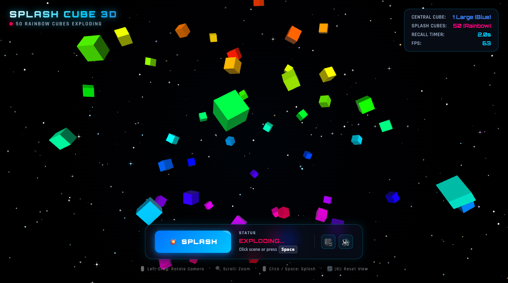

# CS460 - Assignment 02: 3D Splash Cube Visualization

**Interactive 3D Splash Cube Animation & Reassembly Engine**  
Built with [XTK (The X Toolkit)](https://get.goXTK.com) and WebGL.

Based on the design sketch in [`splash_sketch.jpg`](splash_sketch.jpg).

---

## 🎨 Overview & Design



This project implements an interactive 3D visualization using **XTK (The X Toolkit)** and WebGL:

1. **Central Large Blue Cube**: Positioned at the center of the 3D scene `(0, 0, 0)`.
2. **Explosion into 50 Smaller Cubes**: Triggered by mouse click, spacebar, or the HUD **"Splash"** button.
3. **50 Rainbow-Colored Cubes**: Each of the 50 cubes features a unique, mathematically distinct color distributed along the 360° HSV color spectrum.
4. **Outward Splash in All Directions**: Cubes explode uniformly outward in 3D using Fibonacci sphere coordinate distribution with individual tumbling rotational velocities.
5. **Magnetic Recall & Reassembly**: After reaching peak dispersion (2.0 seconds elapsed), a magnetic force pulls all 50 cubes back to the center, cleanly reassembling the central large blue cube with a tactile impact bounce.
6. **Cosmic Black Background with Stars**: Deep black space filled with over 280 twinkling stars and gentle ambient nebulae.
7. **Interactive HUD**: Glassmorphism controls featuring a prominent **Splash** button, live status telemetry, and audio controls.

---

## 🕹️ Controls

| Input | Action |
|:---|:---|
| **Mouse Left-Click (Scene)** | Trigger Splash explosion |
| **HUD Button ("Splash")** | Trigger Splash explosion |
| <kbd>Spacebar</kbd> | Trigger Splash explosion |
| **Mouse Left-Drag** | Orbit / Rotate 3D camera |
| **Mouse Scroll / Pinch** | Zoom in / out |
| **Mouse Right-Drag** | Pan camera |
| <kbd>R</kbd> or 🎥 Button | Reset camera to default view |
| 🔊 Button | Toggle sound synthesizer effects |

---

## ⚙️ Architecture & Animation Lifecycle

```
[ IDLE ] ──(Click / Space)──> [ EXPLODING (0 - 1.1s) ] ──> [ APEX ZERO-G (1.1 - 2.0s) ]
   ▲                                                                  │
   │                                                                  ▼
[ READY ] <── [ REASSEMBLE (3.0 - 3.35s) ] <── [ MAGNETIC RECALL (2.0 - 3.0s) ]
```

- **Outward Phase ($0 \to 1.1$s)**: Central blue cube vanishes as 50 rainbow cubes burst outward with cubic deceleration ($1 - (1 - t)^3$).
- **Zero-G Apex ($1.1 \to 2.0$s)**: Cubes hover in suspended animation near maximum radius with slow tumbling.
- **Magnetic Return ($2.0 \to 3.0$s)**: Cubes accelerate back toward the origin with cubic easing.
- **Reassembly Pulse ($3.0 \to 3.35$s)**: Small cubes hide and the central large blue cube pops back with an elastic impact pulse.

---

## 🚀 How to Run

1. Open [`index.html`](index.html) directly in any modern web browser (Chrome, Firefox, Safari, Edge).
2. Alternatively, run a local web server:
   ```bash
   python3 -m http.server 8000
   ```
   and navigate to `http://localhost:8000/`.
